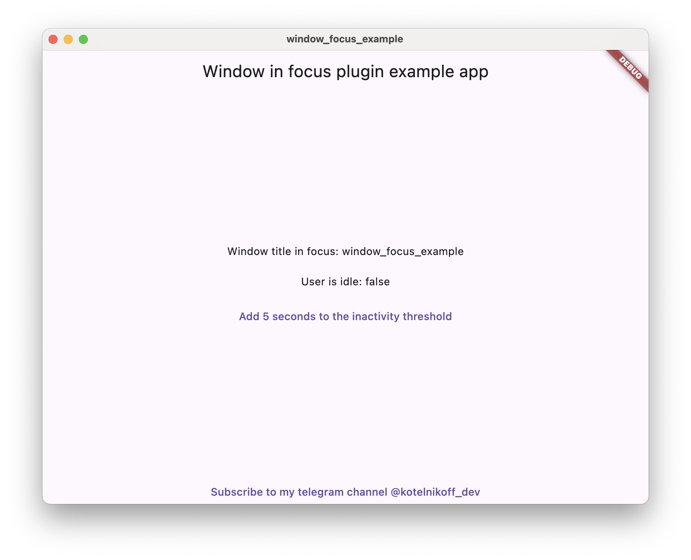

# Window focus plugin

## Language Versions

- [English](README.md)
- [Русский](README_ru.md)


[](https://pub.dev/packages/window_focus)
Window focus - это удобный плагин для Flutter, который позволяет отслеживать бездействие пользователя и получать информацию о заголовке активного окна на  Mac OS и Windows.

## Основные функции:

### Отслеживание бездействия пользователя:
Плагин позволяет определить периоды бездействия пользователя в вашем приложении Flutter. Вы можете настроить пороговое значение бездействия и обрабатывать события бездействия в соответствии с вашими потребностями.
### Получение заголовка активного окна:
предоставляет возможность получить заголовок активного окна операционной системы. Для Mac OS это название приложения, для Windows - заголовок окна.

# Установка плагина
## Windows
Не требует действий
## Mac OS
Необходимо добавить в файл Info.plist MacOs следующий код:
```xml
<key>NSApplicationSupportsSecureRestorableState</key>
<true/>
```
# Использование плагина
```dart
  final _windowFocusPlugin = WindowFocus();
  
  /// Слушатель событий изменения рабочего окна пользователя
  _windowFocusPlugin.addFocusChangeListener((p0) {
    setState(() {
      activeWindowTitle='${p0.windowTitle}';
      /// activeWindowTitle - содержит 2 поля windowTitle = заголовок окна, appName = Название приложения.
     /// На Mac os Эти названия одинаоковые. На Windows appName - это название процесса в котором запущено окно.
    });
  });
  /// Слушатель активности пользователя. Работает с true если пользователь активен и false если пользователь не активен.
  _windowFocusPlugin.addUserActiveListener((p0) {
    setState(() {
      userIdle=p0;
    });
  });
  /// Установка порога бездействия пользователя. По умолчанию 5 секунд.
  _windowFocusPlugin.setIdleThreshold(duration: duration);

  /// Возвращает текущий порог бездействия
  Duration duration = await _windowFocusPlugin.idleThreshold;

```
# От автора
Я в telegram - [@kotelnikoff_dev](https://t.me/kotelnikoff_dev)
[Подкинте автору на кофе](https://www.tinkoff.ru/rm/kotelnikov.yuriy2/PzxiM41989/), а то ему еще песика кормить