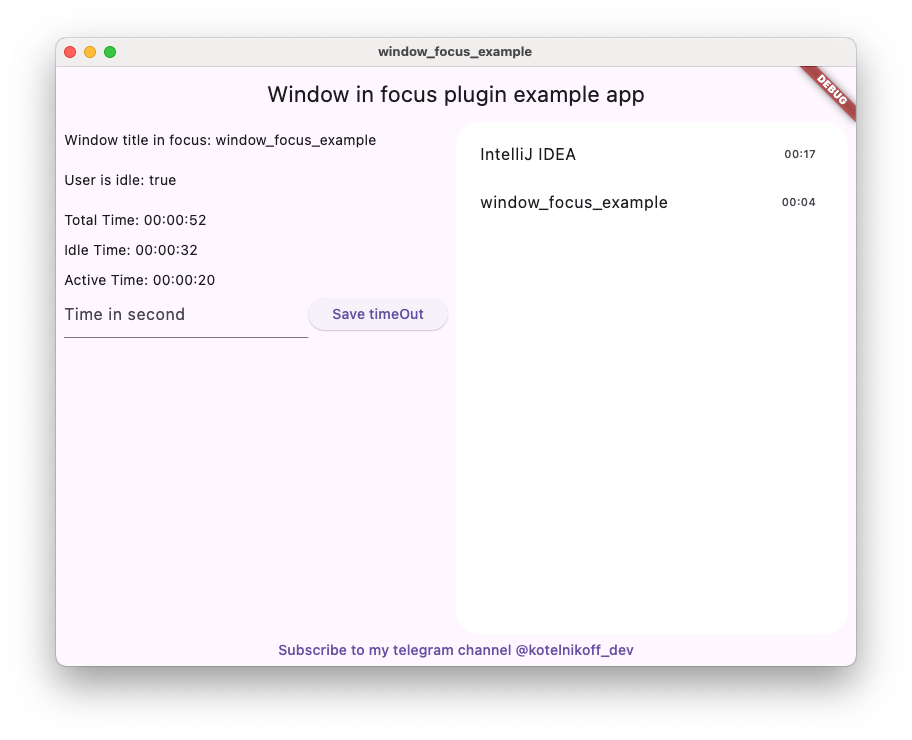

# Window focus plugin

## Language Versions

- [English](README.md)
- [Русский](README_ru.md)


[](https://pub.dev/packages/window_focus)
**Window Focus** — это плагин для Flutter, который позволяет отслеживать активность пользователя и фокус активного окна на платформах Windows и macOS. Плагин предоставляет возможности для определения времени бездействия пользователя, получения информации об активном приложении и включения режима отладки.
## Возможности:

### Отслеживание активности пользователя:
Определяет, когда пользователь активен или бездействует
### Отслеживание активного окна:
Получение заголовка и имени текущего активного окна.
### Режим отладки:
Включение подробных логов для отладки во время разработки.
### Установка тайм-аута бездействия:
Настройка времени, через которое пользователь считается неактивным.

# Установка плагина
## Windows
Не требует действий
## Mac OS
Необходимо добавить в файл Info.plist MacOs следующий код:
```xml
<key>NSApplicationSupportsSecureRestorableState</key>
<true/>
```
# Использование плагина
```dart
  void main() {
  final windowFocus = WindowFocus(debug: true, duration: Duration(seconds: 10));

  // Добавление слушателя изменений активного окна
  windowFocus.addFocusChangeListener((appWindow) {
    print('Активное приложение: ${appWindow.appName}, Заголовок окна: ${appWindow.windowTitle}');
  });

  // Добавление слушателя активности пользователя
  windowFocus.addUserActiveListener((isActive) {
    if (isActive) {
      print('Пользователь активен');
    } else {
      print('Пользователь неактивен');
    }
  });
}
```
# API
## Конструктор
```dart
WindowFocus({bool debug = false, Duration duration = const Duration(seconds: 5)})
```
- `debug` (необязательно): Включает режим отладки для отображения подробных логов.
- `duration` (необязательно): Устанавливает тайм-аут бездействия пользователя. По умолчанию 5 секунд.
## Методы

### Future<void> setIdleThreshold(Duration duration)

Устанавливает тайм-аут бездействия пользователя.
- **Параметры:**
  - `duration`: Время через которое пользователь считается неактивным.
```dart
await windowFocus.setIdleThreshold(Duration(seconds: 15));
```
### Future<Duration> getIdleThreshold()
Возвращает текущий тайм-аут бездействия.
- **Возвращает**: `Duration` — текущий тайм-аут бездействия.

```dart
final threshold = await windowFocus.getIdleThreshold();
print('Тайм-аут бездействия: ${threshold.inSeconds} секунд');
```
### void addFocusChangeListener(Function(AppWindowDto) listener)

Добавляет слушателя изменений активного окна.

- **Параметры:**
  - `listener`: Функция, которая принимает объект AppWindowDto с информацией о текущем активном приложении:
    - `appName`: Имя активного приложения.
    - `windowTitle`: Заголовок активного окна.

**Особенности платформ**
- Windows:
  - `appName` — имя исполняемого файла приложения (например, chrome.exe).
  - `windowTitle` — заголовок активного окна (например, Документация Flutter).
- macOS:
  - `appName` и `windowTitle` совпадают и представляют собой имя активного приложения (например, Safari).

```dart
windowFocus.addFocusChangeListener((appWindow) {
print('Активное приложение: ${appWindow.appName}, Заголовок окна: ${appWindow.windowTitle}');
});
```

### void addUserActiveListener(Function(bool) listener)
Добавляет слушателя изменений активности пользователя.
- **Параметры:**
  - `listener`: Функция, которая принимает bool, указывающий на активность пользователя (true для активного, false для неактивного).
```dart
windowFocus.addUserActiveListener((isActive) {
  if (isActive) {
    print('Пользователь активен');
  } else {
    print('Пользователь неактивен');
  }
});
```

### Future<void> setDebug(bool value)
Включает или отключает режим отладки.
- **Параметры:**
  - `value`: true для включения режима отладки, false для отключения.

```dart
await windowFocus.setDebug(true);
```

# DTO: AppWindowDto
Представляет информацию об активном приложении и окне.

**Свойства**
- **appName**: String — Имя активного приложения.
- **windowTitle**: String — Заголовок активного окна (для macOS совпадает с appName).

**Пример**

```dart
final appWindow = AppWindowDto(appName: "Chrome", windowTitle: "Flutter Documentation");
print(appWindow); // Output: Window title: Flutter Documentation. AppName: Chrome
```

# От автора
Я в telegram - [@kotelnikoff_dev](https://t.me/kotelnikoff_dev)
[Подкинте автору на кофе](https://www.tinkoff.ru/rm/kotelnikov.yuriy2/PzxiM41989/), а то ему еще песика кормить